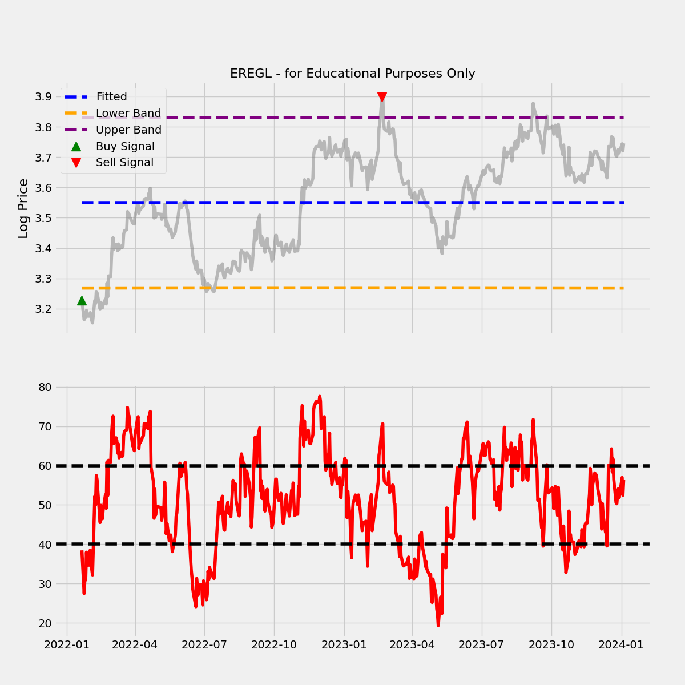

# Technical-Analysis-with-Pandas-TA

In this collection of Jupyter notebooks, we explore various trading strategies implemented using the powerful pandas_ta library. Each notebook focuses on a distinct algorithm or strategy, providing detailed explanations, visualizations, and performance analyses.

### Additional Libraries

[pandas_ta](https://github.com/twopirllc/pandas-ta)

[isyatirimhisse](https://github.com/urazakgul/isyatirimhisse) (Recommended for BIST- Turkish Stock Market)

[yfinance](https://github.com/ranaroussi/yfinance)


1- **Relative Strength Index (RSI) Strategy:**

Dive into trading signals generated by the Relative Strength Index (RSI), a momentum oscillator that measures the speed and change of price movements. Additionally, discover how logistic regression is integrated to enhance the predictive power of RSI signals.



2- **Coming Soon**


### Environment

```BASH
pyenv local 3.11.3
python -m venv .venv
source .venv/bin/activate
pip install --upgrade pip
pip install -r requirements.txt
```


### Note:
These notebooks are designed for educational purposes and should not be considered financial advice. Always conduct thorough research and consider the risks involved before implementing any trading strategy.

Feel free to explore, experiment, and contribute to this repository.